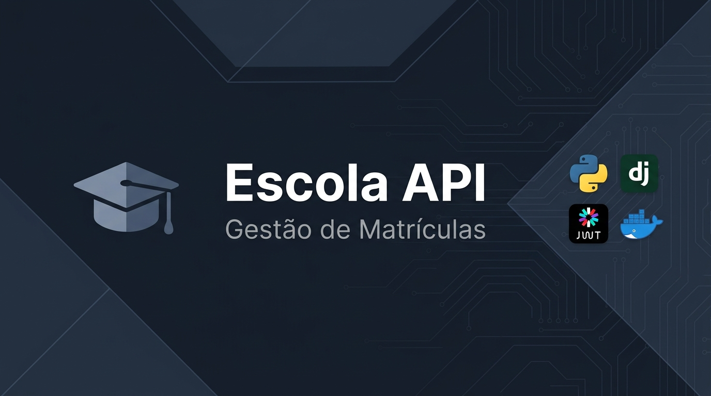

# API de Gestão de Matrículas

<p align="center">
  
</p>

<p align="center">
  
  
  
  
  
  
  
  
</p>

API REST para gerenciamento de estudantes, cursos e matrículas, desenvolvida com Django 5 e Django REST Framework.

O projeto é **100% conteinerizado**, utilizando PostgreSQL e a API Django orquestrados via Docker Compose. Inclui autenticação via JWT (Bearer Token), documentação automatizada (Swagger/OpenAPI 3.0) e uma pipeline de CI com GitHub Actions que roda linter e testes automaticamente a cada push.

## Requisitos

- Docker e Docker Compose instalados na sua máquina
- Git (caso o projeto ainda não esteja clonado localmente)

*Nota: Se você quiser rodar ferramentas de desenvolvimento locais (como linters), recomendamos também a instalação do [uv](https://docs.astral.sh/uv/) e execução do comando `uv sync`.*

## Estrutura principal

```text
pyproject.toml            # dependências e configurações do projeto (UV / PEP 621)
Dockerfile                # instrução de construção da imagem da API
docker-compose.yml        # orquestração dos serviços (banco de dados e API)
.github/workflows/ci.yml  # pipeline de CI com GitHub Actions
manage.py                 # comandos administrativos do Django
setup/                    # configurações, URLs e servidores ASGI/WSGI
escola/                   # modelos, serializers, views e migrações
```

---

## Como executar o projeto

Graças ao Docker Compose, rodar o projeto é extremamente simples e reproduzível.

### 1. Subir a infraestrutura (Banco de Dados + API)

A partir da pasta raiz do projeto, construa e inicie os containers em background:

```bash
docker compose up --build -d
```

> A primeira execução pode levar alguns instantes para baixar as imagens e construir a API. O código possui **hot-reload** configurado: se você alterar arquivos Python localmente, o container será reiniciado automaticamente.

### 2. Aplicar as migrações do banco de dados

Com os containers rodando, execute as migrações no container da API:

```bash
docker compose exec api uv run python manage.py migrate
```

### 3. Criar um usuário administrador

Crie um usuário para conseguir se autenticar na documentação e gerar tokens JWT:

```bash
docker compose exec api uv run python manage.py createsuperuser
```

Feito isso, a API estará 100% funcional e disponível em: **http://127.0.0.1:8000/**

---

## Documentação da API (Swagger / OpenAPI)

Com o servidor rodando, você pode acessar a documentação interativa gerada automaticamente pelo `drf-spectacular`. Nela é possível visualizar os modelos e realizar testes de requisições.

- **Swagger UI (Recomendado para testar):** [http://127.0.0.1:8000/api/docs/](http://127.0.0.1:8000/api/docs/)
- **ReDoc (Visualização elegante):** [http://127.0.0.1:8000/api/redoc/](http://127.0.0.1:8000/api/redoc/)
- **Schema Bruto (YAML/JSON):** [http://127.0.0.1:8000/api/schema/](http://127.0.0.1:8000/api/schema/)

**Como testar a API no Swagger:**
1. Acesse o **Swagger UI**.
2. Vá até o endpoint `POST /api/token/` e clique em *Try it out*.
3. Execute passando o `username` e `password` que você criou no passo 3.
4. Copie o valor de `access` gerado na resposta.
5. Clique no botão verde **"Authorize"** (no topo da página) e cole o seu token.
6. Pronto! Agora você pode testar todos os outros endpoints protegidos.

---

## Endpoints disponíveis

As rotas da API exigem um **JWT Bearer Token** válido no cabeçalho `Authorization`.

| Método | Endpoint | Objetivo |
| --- | --- | --- |
| POST | `/api/token/` | Gerar tokens JWT de acesso e refresh |
| POST | `/api/token/refresh/` | Renovar o token de acesso |
| GET, POST | `/estudantes/` | Listar ou criar estudantes |
| GET, PUT, PATCH, DELETE | `/estudantes/<id>/` | Consultar, alterar ou remover um estudante |
| GET, POST | `/cursos/` | Listar ou criar cursos |
| GET, PUT, PATCH, DELETE | `/cursos/<id>/` | Consultar, alterar ou remover um curso |
| GET, POST | `/matriculas/` | Listar ou criar matrículas |
| GET, PUT, PATCH, DELETE | `/matriculas/<id>/` | Consultar, alterar ou remover uma matrícula |
| PATCH | `/matriculas/<id>/trancar/` | Trancar uma matrícula ativa |
| PATCH | `/matriculas/<id>/cancelar/` | Cancelar uma matrícula ativa ou trancada |
| PATCH | `/matriculas/<id>/finalizar/` | Finalizar uma matrícula ativa (conclusão) |
| GET | `/estudantes/<id>/matriculas/` | Listar cursos de um estudante |
| GET | `/cursos/<id>/matriculas/` | Listar estudantes de um curso |

---

## Autenticação via CLI (Curl)

Se preferir testar via linha de comando no seu terminal, obtenha seu token e faça requisições assim:

```bash
# 1. Pegar o Token
curl -X POST http://127.0.0.1:8000/api/token/ \
  -H "Content-Type: application/json" \
  -d '{"username": "seu_usuario", "password": "sua_senha"}'

# 2. Fazer requisição usando o Token retornado
curl -H "Authorization: Bearer <seu_token_access>" http://127.0.0.1:8000/estudantes/
```

---

## Pipeline de CI (GitHub Actions)

O projeto possui uma pipeline de Integração Contínua configurada em [`.github/workflows/ci.yml`](.github/workflows/ci.yml) que é disparada automaticamente a cada `push` ou `Pull Request` para a branch `main`.

A pipeline realiza as seguintes etapas em sequência:

1. 📥 **Clona o repositório**
2. ⚡ **Instala o `uv`** (gerenciador de dependências)
3. 📦 **`uv sync`** — instala todas as dependências
4. 🔍 **`ruff check`** — valida o estilo e qualidade do código
5. 🗄️ **`migrate`** — aplica as migrações em um banco PostgreSQL temporário
6. ✅ **`manage.py test`** — roda todos os testes automatizados

Se qualquer etapa falhar, o merge é bloqueado automaticamente no GitHub.

---

## Comandos Úteis e Desenvolvimento

Como o projeto roda no Docker, você executará os comandos do Django através do `docker compose exec api ...`.

**Ver logs da aplicação em tempo real:**
```bash
docker compose logs -f api
```

**Gerar novas migrações (após mudar o models.py):**
```bash
docker compose exec api uv run python manage.py makemigrations
docker compose exec api uv run python manage.py migrate
```

**Executar os testes automatizados:**
```bash
docker compose exec api uv run python manage.py test -v 2
```

## Solução de problemas

### `401 Unauthorized`
O token JWT pode estar expirado ou ausente. Gere um novo token em `/api/token/` ou renove-o em `/api/token/refresh/`.

### Erro de Conexão com o Banco / PostgreSQL
Certifique-se de que os containers do Docker estão rodando com `docker compose ps`. Caso a API tenha falhado por iniciar antes do banco, ela será reiniciada automaticamente, mas você pode forçar um reinício com `docker compose restart api`.
